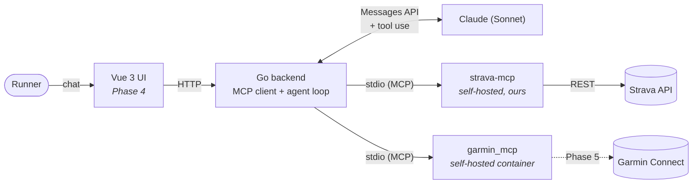

<div align="center">

# 🏃 RunCoach AI

**A chat-first AI running coach that reasons across your Strava _and_ Garmin data — answering questions neither app can answer alone.**

_by [Leo Magsino Jr](https://github.com/lmagsino)_


</div>

---

## The idea

Strava and Garmin don't share data with each other — but an agent can hold both at once. RunCoach AI connects to each source over the **Model Context Protocol (MCP)**, then reasons across the combined result to answer natural-language training questions:

> _"Does my sleep actually affect my pace?"_ · _"Am I overtraining right now?"_ · _"I have a half marathon in 10 weeks — am I on track, factoring in how recovered I've been?"_

No dashboards, no cards, no widgets. **The chat interaction _is_ the product.**

## Why it's different

| Capability | Strava alone | Garmin alone | RunCoach AI |
|---|:---:|:---:|:---:|
| Sleep/HRV vs. pace correlation | ❌ | ❌ | ✅ combines both |
| Overtraining detection (load + effort variability) | ❌ | ⚠️ partial | ✅ full picture |
| Free-form Q&A over your history | ❌ | ❌ | ✅ core interaction |
| Reconciling conflicting data (same run, different HR) | ❌ | ❌ | ✅ |
| Readiness-adjusted race planning | ⚠️ | ⚠️ | ✅ both signals |

## Architecture

The Go backend is a pure **MCP client**. Each data source is a **self-hosted MCP server** it connects to — keeping the whole system free, local, and fully under our control.



When a question arrives, Claude decides which tools to call — Strava only, Garmin only, or **both** — the backend routes each call to the server that owns it, and Claude answers **grounded only in what the tools returned**, no generic training-advice filler. Every answer reports which sources it actually drew on.

Both servers expose an activities listing, so tools are namespaced per source (`strava__get_activities`, `garmin__get_sleep_data`). Without that, a routing slip would silently answer a Strava question with Garmin data — wrong numbers, no error.

> **Design note:** the spec originally called for Strava's _hosted_ MCP (`mcp.strava.com`). It turned out to require a paid Strava subscription and is gated to Claude's first-party connector — so we run our **own** thin Strava MCP server over Strava's free REST API instead. Same MCP story, no external gatekeeping.

## Tech stack

| Layer | Choice |
|---|---|
| Backend | **Go 1.26** — stdlib `net/http`, `pgx/v5`, `golang-migrate` |
| Agent | **Claude (Sonnet)** via the Anthropic Go SDK, tool-calling loop |
| Protocol | **MCP** via the official `modelcontextprotocol/go-sdk` |
| Database | **Postgres** — chat sessions/messages + normalized activity cache |
| Garmin | **`Taxuspt/garmin_mcp`** in a container, installed from git at a pinned commit |
| Auth | **Strava OAuth2** (per-user), tokens stored + auto-refreshed · **Garmin** email/password + MFA, authenticated once into a token volume |
| Frontend | **Vue 3 + Tailwind** _(Phase 4)_ |
| Hosting | **Local-only** for v1 — no infra to manage |

## Repository layout

```
run-coach-ai/
├── DESIGN.md, design/                 # Phase 1 — "Field Notes" UI direction
├── running-agent-feature-spec.md      # Full feature spec
├── PROGRESS.md                        # Cross-session task tracker
├── CLAUDE.md                          # Contributor / agent guide
├── deploy/garmin-mcp/                 # Garmin MCP container (Phase 3)
│   ├── Dockerfile                     # garmin_mcp at a pinned upstream commit
│   └── docker-compose.yml             # image build + one-time interactive auth
└── backend/                           # Go API (Phase 2)
    ├── cmd/
    │   ├── server/       # HTTP API: /healthz, /auth/strava/*, /chat
    │   ├── migrate/      # DB migration runner
    │   ├── strava-mcp/   # self-hosted Strava MCP server (stdio)
    │   └── strava-check/ # CLI: proves list_activities over MCP
    └── internal/
        ├── config/  db/  strava/  api/
        ├── mcpclient/    # spawns strava-mcp / garmin_mcp over stdio
        └── agent/        # Claude tool-loop over N namespaced MCP sources
```

## Getting started

**Prerequisites:** Go 1.26+, Postgres 15+, a [Strava API app](https://www.strava.com/settings/api) (Client ID/Secret), and an [Anthropic API key](https://console.anthropic.com). Docker is needed only for Garmin.

```bash
cd backend
cp .env.example .env         # fill in Strava + Anthropic credentials

createdb runcoach_dev        # one-time (local Postgres)
go run ./cmd/migrate up      # apply schema
go run ./cmd/server          # API on http://localhost:8080
```

Then connect Strava and ask a question:

```bash
# 1. Authorize Strava (opens Strava's consent screen)
open http://localhost:8080/auth/strava/login

# 2. Prove the MCP path returns real activities
go run ./cmd/strava-check

# 3. Ask the coach → {"answer": "...", "sources": ["strava"]}
curl -s localhost:8080/chat -d '{"question":"how many runs did I do last week?"}'
```

### Adding Garmin

Garmin is wired in but **off unless configured** — `GARMIN_MCP_COMMAND` unset means Strava is the only source, so the backend never tries to launch a container that isn't there yet.

```bash
cd deploy/garmin-mcp
docker compose build                                    # garmin_mcp at the pinned commit
docker compose --profile auth run --rm garmin-mcp-auth  # interactive: login, then MFA code
```

Uncomment `GARMIN_MCP_COMMAND` in `backend/.env` and restart — the server logs `agent tool sources: strava, garmin`. The auth step is one-off: it writes OAuth tokens (good for ~6 months) into a named volume the container reuses, so no credentials are needed per request.

> ⚠️ These steps are **written but not yet exercised** — the image has never been built and no Garmin account is connected. Phase 5 runs them for real. Note also that `garmin_mcp` drives Garmin Connect's *private* endpoints with a personal login: there is no official API, so it can break when Garmin changes them.

### Testing — no credentials, no Docker, no network

```bash
go test ./...
```

The agent's full tool-calling loop runs against **in-process stub MCP servers** and a **scripted stand-in for the Messages API**, covering tool namespacing and routing, each source-selection plan, and cross-source scenarios on fabricated sleep/pace datasets. One test asks the *real* model to choose its own sources over that fake data, and is skipped unless you opt in:

```bash
RUNCOACH_LIVE_MODEL_TESTS=1 go test ./internal/agent/ -run LiveModel -v   # costs Anthropic tokens
```

## Roadmap

- [x] **Phase 1 — Design** · chat UI direction ("Field Notes"), locked in [`DESIGN.md`](DESIGN.md)
- [x] **Phase 2 — Backend Foundations** · Go API, Postgres, Strava OAuth, self-hosted Strava MCP, Claude tool-loop
- [x] **Phase 3 — Garmin Integration** · `garmin_mcp` container, second tool source, cross-source tool selection
- [ ] **Phase 4 — Frontend** · Vue 3 chat UI against the Phase 1 design
- [ ] **Phase 5 — Credentials & Live Verification** · real accounts end-to-end, then polish + demo

> Phases 2–4 are **code checkpoints**: everything builds, and the MCP plumbing and agent behaviour are tested against stubs and fabricated data. Nothing has touched a live service yet — no Strava OAuth exchange, no Garmin account, no container built. All credential work is deliberately consolidated into Phase 5 so progress never blocks on account setup or API approvals, and everything gets validated together at one point rather than in scattered halves.

## Design

The chat UI follows a **"Field Notes"** direction: quiet-luxury, one confident accent color, generous whitespace, and assistant replies that read as flowing prose rather than chat bubbles — a deliberate anti-chatbot move. Full reference in [`DESIGN.md`](DESIGN.md); working mockup at [`design/mockup.html`](design/mockup.html).

| Token | Hex | Role |
|---|---|---|
| `paper` | `#EDECE6` | App background (soft greige) |
| `ink` | `#1C201C` | Primary text (forest-charcoal) |
| `accent` | `#2E5D4E` | Deep pine green — the one accent |

---

<div align="center">

**Built by [Leo Magsino Jr](https://github.com/lmagsino)** · Personal portfolio project · 2026

</div>
